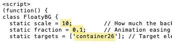

# 014-Floaty_BG
Add a floating animation effect to your Carrd's page or container background pattern that responds to mouse movement.

## How to set up
1. Paste the .js code into a Carrd Embed element.  
2. Set the Embed element to **Hidden** and **Body End**.  
3. Locate the following code block. You can adjust the following settings to suit your needs:  

   

  - **scale** – Controls how much the background shifts based on the cursor’s position. (Optional)
  - **fraction** – Controls the easing/smoothing of the animation. (Optional)
  - **targets** – An array of container IDs you want the effect applied to. You can include multiple IDs, separated by commas.  
    - Example:
      - **static targets = ['container02', 'container07'];**
    - To apply the effect to the entire page background, use:
      - **static targets = ['body'];**
      - Or even combine them:
        - **static targets = ['body', 'container07'];**

## License

By using this code, you agree to these terms:

- Permission is granted to use this code in personal and commercial projects.

- However, reselling the code, either as a standalone product or as part of another project, is strictly prohibited.

- Redistribution of the source files, modified or unmodified, is not permitted.

 

   Copyright (c) 2025 Yi-Fang Chen  

